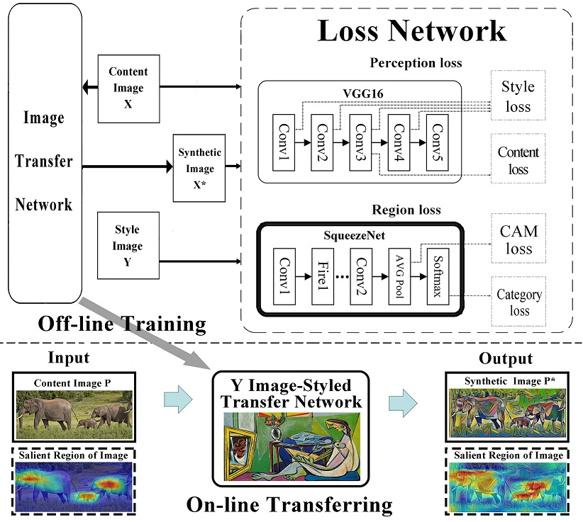

Implement of "Image Neural Style Transfer With Preserving the Salient Regions."  https://ieeexplore.ieee.org/abstract/document/8606126

Purpose: Keep the discriminative regions of the original content image unchanged while performing Stylization.

Main work: Based on "fast-neural-style" in the official example of Pytorch  (https://github.com/pytorch/examples/tree/master/fast_neural_style) and Bolei Zhou's “Sample code for the Class Activation Mapping” (https://github.com/metalbubble/CAM). We added the focus image generation module to the fast-neural-style code, and further added focus loss and category loss to the total loss.

Result: After training, the style Transfer model can not only capture the style of the specified style image and migrate it to the input content image, but also maintain the discriminative regions of the output image consistent with the input content image. This allows the output style transition image to be applied to tasks related to the discriminative regions, such as Screenshots based on discriminative regions,Focus determination, and the like.

Require:  
Linux  
Pytorch 0.4.0  
torchvision 0.2.1  
numpy  
tensorboardX  
PIL  
